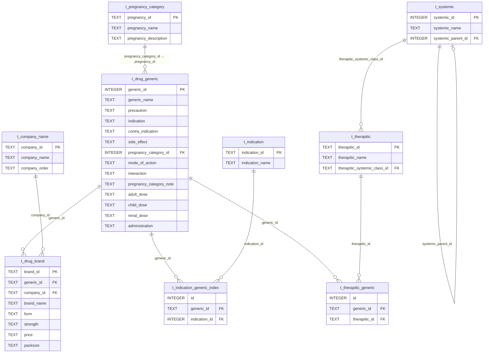
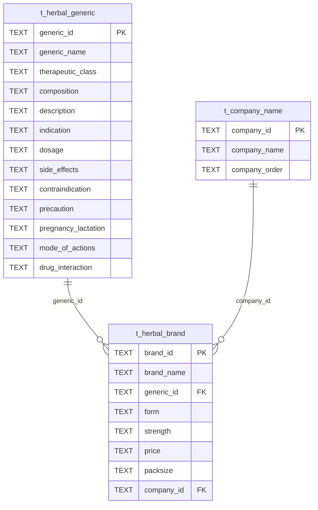
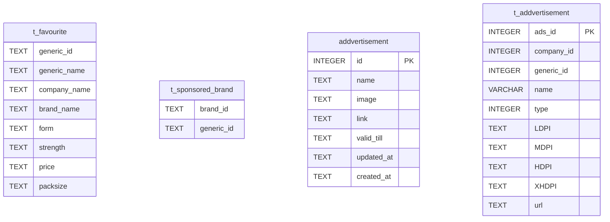
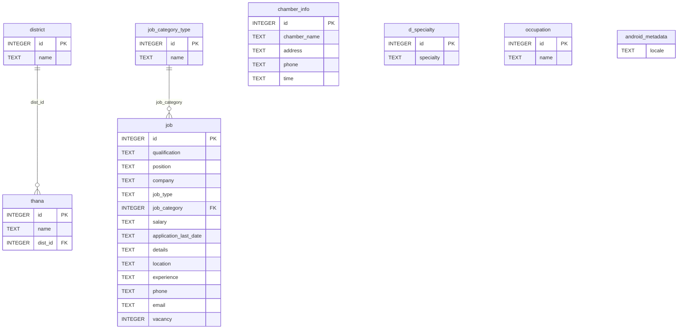
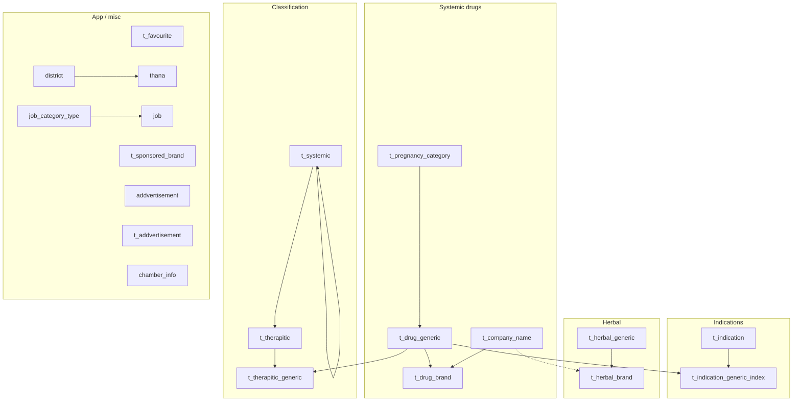

# DIMS drug catalog — SQLite schema (`dims_drug_catalog.sqlite`)

This document visualizes the database structure with [Mermaid](https://mermaid.js.org/) diagrams. SQLite does **not** declare `FOREIGN KEY` constraints in this file; relationships below are **logical** (how the app joins data). Some columns use different types for the same concept (e.g. `generic_id` as `INTEGER` vs `TEXT`).

---

## 1. Table inventory

| Table | Role |
|--------|------|
| `t_drug_generic` | Core systemic drug monograph (doses, pregnancy ref, text fields). |
| `t_drug_brand` | Brand lines linked to generic + company. |
| `t_company_name` | Pharmaceutical company directory. |
| `t_pregnancy_category` | Pregnancy category lookup. |
| `t_indication` | Indication lookup. |
| `t_indication_generic_index` | Many-to-many: generic ↔ indication. |
| `t_systemic` | Hierarchical systemic classification (`systemic_parent_id` self-reference). |
| `t_therapitic` | Therapeutic class; points at systemic class via text id. |
| `t_therapitic_generic` | Many-to-many: generic ↔ therapeutic class. |
| `t_herbal_generic` | Herbal monograph. |
| `t_herbal_brand` | Herbal brands. |
| `t_favourite` | User favourites (denormalized snapshot fields). |
| `t_sponsored_brand` | Sponsored brand ↔ generic links. |
| `addvertisement` | Simple ads (`id` autoincrement). |
| `t_addvertisement` | Richer ads with DPI assets + `company_id` / `generic_id`. |
| `district` | Districts. |
| `thana` | Thanas/upazilas; `dist_id` → district. |
| `d_specialty` | Specialty lookup. |
| `occupation` | Occupation lookup. |
| `job_category_type` | Job category lookup. |
| `job` | Job postings; `job_category` → category type. |
| `chamber_info` | Doctor chamber listings. |
| `android_metadata` | Android locale metadata (single row pattern). |
| `sqlite_sequence` | Internal SQLite autoincrement sequence table. |

---

## 2. Core drug & classification (systemic)

---

## 3. Herbal products

---

## 4. Favourites, sponsorship, advertisements

*Notes:* `t_favourite` stores a flat snapshot (not necessarily FK-linked rows). `t_sponsored_brand` logically references brand/generic ids from the drug tables. `addvertisement` and `t_addvertisement` are two separate ad models.

---

## 5. Geography, jobs, chambers, lookups

---

## 6. High-level map (how domains connect)

Dotted line from `t_company_name` to `t_herbal_brand`: logical link via `company_id`, same as systemic path.

---

## 7. Implementation notes

- **Primary keys:** Only `addvertisement.id`, `chamber_info.id`, and `t_addvertisement.ads_id` are declared `PRIMARY KEY` in SQL. Other tables rely on application-level uniqueness (many ids are `TEXT`).
- **Indexes:** The only explicit index besides PKs is the auto-index on `t_addvertisement` (`ads_id`).
- **ID types:** Junction tables often use `TEXT generic_id` while `t_drug_generic.generic_id` is `INTEGER` — clients may coerce when joining.
- **`sqlite_sequence`:** Used by SQLite for `AUTOINCREMENT` bookkeeping; not application data.
